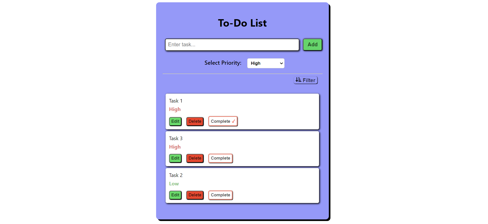

# ToDo List Web App

A simple web application to manage your tasks with priority levels. You can add tasks, mark them as complete, delete tasks, and filter tasks by priority and completion status. and our tasks persist even after refreshing the page or closing the browser.

## Features

- **Add Task:** Add new tasks to your to-do list, including a priority level (high or low).

- **Edit Task:** Edit existing tasks in the list to update details.

- **Mark as Complete:** Mark tasks as complete when you finish them.

- **Delete Task:** Remove tasks from the list that are no longer needed.

- **Filtering:**

  - **By Priority:** Filter tasks based on priority levels (high or low).
  - **By Completion:** Filter tasks based on completion status (complete or incomplete).

- **Local Storage:** Your tasks persist even after refreshing the page or closing the browser, thanks to local storage.

## Technologies Used

- HTML
- CSS
- JavaScript

## Usage

1. **Adding a Task:**

   - Enter the task details in the input field.
   - Select the priority level (high or low).
   - Click the "Add Task" button.

2. **Editing a Task:**

   - Click on edit button of the task you want to edit.
   - Update the task details.
   - Click the "ok" button.

3. **Marking as Complete:**

   - Click the "Complete" button next to the task you want to mark as complete.

4. **Deleting a Task:**

   - Click the "Delete" button next to the task you want to remove.

5. **Filtering Tasks:**
   - priority to show tasks based on priority level.
   - completion to show tasks based on completion status.

## Persistence with Local Storage

This ToDo list web app utilizes local storage to ensure that your tasks persist even if you refresh the site or close the browser. The tasks are stored locally on your device, allowing you to access your to-do list across sessions.

### How it Works

When you add, edit, complete, or delete a task, the web app updates the local storage with the latest list of tasks. Upon refreshing the page or returning to the app, it retrieves the tasks from local storage and displays them, maintaining your latest changes.

### Note

Local storage is specific to the device and browser you are using. If you switch browsers or use a different device, your tasks may not be synchronized.

## Demo

## Installation

1. Clone the repository: `git clone https://github.com/your-username/todo-list-web-app.git`
2. Open the `index.html` file in your web browser.

## Contributing

If you'd like to contribute, please fork the repository and submit a pull request. Issues and feature requests are welcome!

## License

This project is licensed under the [MIT License](LICENSE.md).

---

Feel free to replace placeholders like `your-username` with your actual GitHub username and update the links accordingly. Add more details or sections as needed for your specific application.
